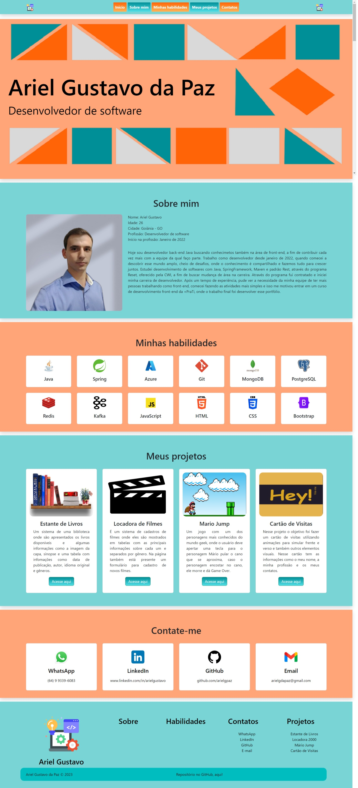

# Meu Portfólio
___

**Acesse o portfólio** [aqui!](https://arielgpaz.github.io/portfolio-static-page/)

## Sobre o projeto

Esse projeto foi desenvolvido para apresentar uma parte do meu conhecimento na área 
de desenvolvimento de softwares e ele foi construído como projeto final do curso
**Desenvolvimento Front End: do zero ao primeiro site**, uma parceria da 
[+praTi](https://www.maisprati.com.br/) com a [Happy](https://www.vemserhappy.com.br/).  

Ao acessar esse site você verá uma tela como a da imagem abaixo, onde cotém alguns elementos como:
- Menu fixado para facilitar a navegação;
- Uma breve apresentação sobre mim;
- Habilidades que desenvolvi durante a carreira como desenvolverdor back-end e outras que adquiri nos estudos do dia-a-dia;
- Projetos de front-end que desenvolvi durante o curso citado acima;
- Meus contatos, para você me encontrar e quem sabe a gente bater um papo;
- Rodapé com a estrutura do site.

Para contruir isso, foram usadas as tecnologias:

- HTML
- CSS
- Bootstrap
- JavaScript

